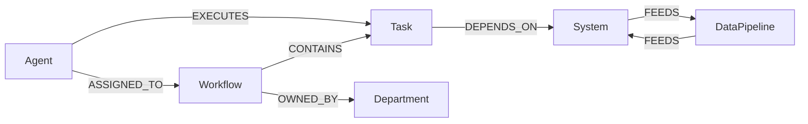
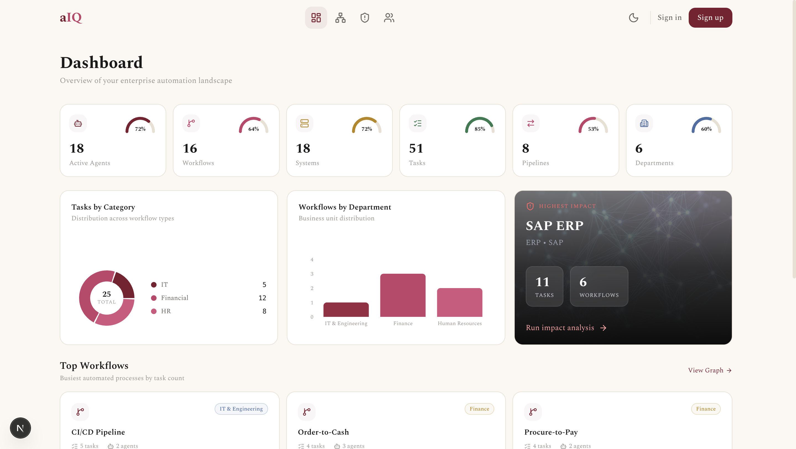
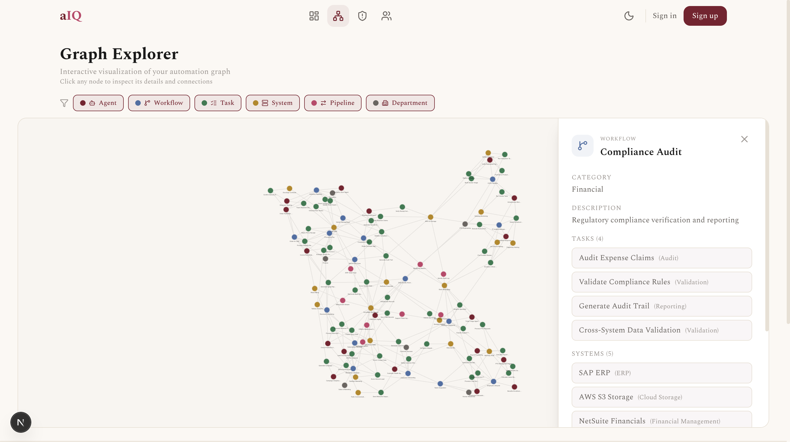
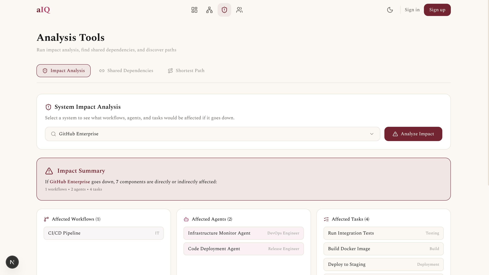
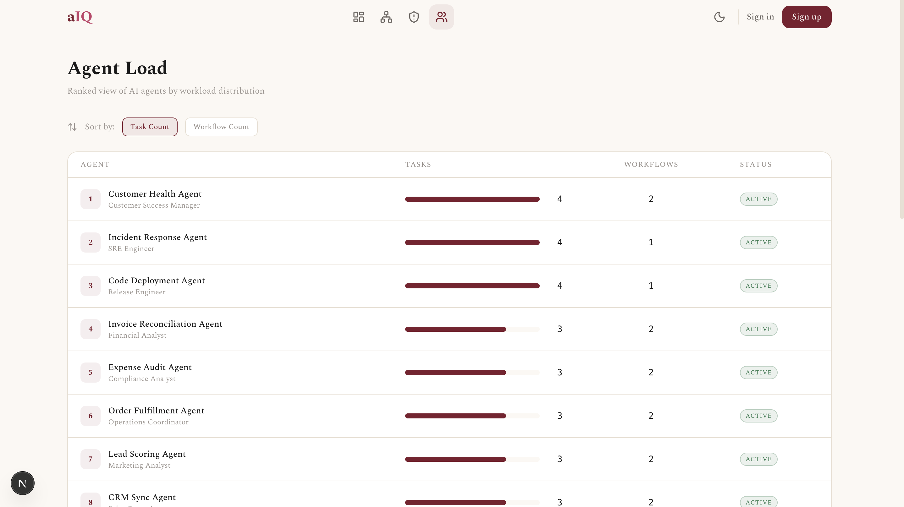

# AutomatIQ: Automation Intelligence Dashboard

A graph-database-backed web application for visualizing and analyzing an enterprise's automation landscape. Built with **CognoDB** (a managed graph database speaking openCypher), **Express.js** (TypeScript), and **Next.js** (App Router + Tailwind CSS).

**[Live Demo →](#)** *(link to be updated after deployment)*

---

## Use Case

AutomatIQ models an enterprise's automation ecosystem: AI agents ("virtual coworkers"), the workflows they run, tasks inside those workflows, systems they integrate with, and data pipelines connecting systems. It answers the questions ops teams actually ask:

- **Impact Analysis**: "If Salesforce CRM goes down, which workflows and agents are affected?" (multi-hop traversal)
- **Shared Dependency Detection**: "Which workflows secretly depend on the same system?" (variable-length path)
- **Agent Load**: "Which agent is running the most tasks across the most workflows?" (aggregation)
- **Path Finding**: "What's the shortest dependency chain between Workflow A and System B?" (shortestPath)

---

## Why a Graph Database?

Impact-analysis and shared-dependency questions require traversing relationships of unknown depth. In SQL, this means recursive CTEs or application-side BFS across multiple join tables, queries that are awkward to write, harder to optimize, and painful to maintain as the schema evolves.

In Cypher (the query language CognoDB speaks), the same question is a single pattern match:

```cypher
MATCH (s:System {name: $name})<-[:DEPENDS_ON]-(t:Task)<-[:CONTAINS]-(w:Workflow)
MATCH (a:Agent)-[:ASSIGNED_TO]->(w)
RETURN w, a, t
```

Finding shared dependencies between two workflows: a query that would require a self-join on at least three intermediate tables in SQL is equally natural:

```cypher
MATCH (w1:Workflow {name: $w1})-[:CONTAINS]->(:Task)-[:DEPENDS_ON]->(s:System)
      <-[:DEPENDS_ON]-(:Task)<-[:CONTAINS]-(w2:Workflow {name: $w2})
RETURN DISTINCT s
```

Graph databases also make the data model self-documenting: nodes and relationships map directly to the business concepts, making it easier to onboard new team members and reason about the system.

---

## Data Model



### Node Types

| Node | Properties | Count |
|------|-----------|-------|
| **Agent** | name, role, status | 18 |
| **Workflow** | name, description, category | 16 |
| **Task** | name, type, avgDurationMinutes | 51 |
| **System** | name, type, vendor | 18 |
| **DataPipeline** | name, direction | 8 |
| **Department** | name | 6 |

### Relationship Types

| Relationship | From → To | Meaning |
|-------------|-----------|---------|
| EXECUTES | Agent → Task | Agent performs this task |
| ASSIGNED_TO | Agent → Workflow | Agent works on this workflow |
| CONTAINS | Workflow → Task | Workflow includes this task |
| OWNED_BY | Workflow → Department | Department owns this workflow |
| DEPENDS_ON | Task → System | Task requires this system |
| FEEDS | System → DataPipeline → System | Data flows between systems |

---

## Architecture

```
┌─────────────────┐     HTTP/JSON      ┌──────────────────┐     Bolt 5.x      ┌──────────────┐
│   Next.js App   │ ──────────────────→ │  Express.js API  │ ────────────────→ │   CognoDB    │
│   (Port 3000)   │                     │   (Port 4000)    │                   │  (Cloud)     │
│   /client       │                     │   /server        │                   │              │
└─────────────────┘                     └──────────────────┘                   └──────────────┘
```

---

## Main Queries Explained

### 1. Impact Analysis (Multi-hop)
Given a system name, traverses `DEPENDS_ON` relationships to find tasks, then follows `CONTAINS` relationships to workflows, and `ASSIGNED_TO` to agents. Also follows `FEEDS` through data pipelines to discover downstream system effects. This is a 2+ hop traversal that would require recursive CTEs or multiple round-trips in SQL.

### 2. Shared Dependency Finder (Variable-length Path)
Finds systems or tasks that two workflows both depend on by matching a path pattern: `Workflow1 → Task → System ← Task ← Workflow2`. The `UNION` also checks for shared tasks directly. In SQL, this would be a self-join across workflow-task-system tables.

### 3. Agent Load Ranking (Aggregation)
Counts distinct tasks and workflows per agent using `OPTIONAL MATCH` and `count(DISTINCT ...)`, sorted descending. Straightforward in both Cypher and SQL, but the graph model makes the joins implicit.

### 4. Shortest Path
Uses Cypher's built-in `shortestPath()` function to find the shortest undirected path between any two named nodes. This is a BFS algorithm that graph databases execute natively in SQL, you'd need recursive CTEs with cycle detection.

### 5. List/Detail Views
Standard `MATCH` with `OPTIONAL MATCH` for immediate neighbors. Each detail view returns the node's properties plus all directly connected nodes.

---

## Setup & Run Instructions

### Prerequisites
- Node.js 18+
- npm

### 1. Create a CognoDB Instance
1. Go to [console.cognodb.com/signup](https://console.cognodb.com/signup)
2. Create a free (c0) instance
3. Save the connection URI and password (shown only once)

### 2. Clone & Configure

```bash
git clone <repo-url>
cd wexaAI
```

#### Server
```bash
cd server
cp .env.example .env.local
# Edit .env.local with your CognoDB credentials:
# COGNODB_URI=bolt+s://your-instance.databases.cognodb.cloud
# COGNODB_USER=cognodb
# COGNODB_PASSWORD=your-password
npm install
```

#### Client
```bash
cd client
cp .env.example .env.local
# Edit .env.local:
# NEXT_PUBLIC_API_URL=http://localhost:4000/api
npm install
```

### 3. Seed the Database

```bash
cd server
npm run seed
```

This creates 117 nodes (18 agents, 16 workflows, 51 tasks, 18 systems, 8 pipelines, 6 departments) with dense relationships. The script is idempotent so it is safe to re-run.

### 4. Run the Application

Terminal 1 (API):
```bash
cd server
npm run dev
# → http://localhost:4000
```

Terminal 2 (Frontend):
```bash
cd client
npm run dev
# → http://localhost:3000
```

---

## Screenshots

### Dashboard


### Graph Explorer


### Impact Analysis


### Agent Load


---

## Project Structure

```
wexaAI/
├── server/                          # Express.js + TypeScript REST API
│   ├── src/
│   │   ├── config/database.ts       # Neo4j driver singleton
│   │   ├── middleware/errorHandler.ts
│   │   ├── routes/                  # Express route handlers
│   │   ├── services/                # Business logic + Cypher queries
│   │   ├── types/index.ts           # TypeScript interfaces
│   │   └── index.ts                 # Entry point
│   ├── seed/seed.ts                 # Idempotent seed script
│   ├── .env.example
│   └── package.json
│
├── client/                          # Next.js App Router frontend
│   ├── src/
│   │   ├── app/                     # Pages (dashboard, explorer, impact, agents)
│   │   ├── components/              # UI components (Toast, ErrorPopup, Skeleton, etc.)
│   │   ├── hooks/useQuery.ts        # Generic data-fetching hook
│   │   └── lib/api.ts               # Typed API client
│   ├── .env.example
│   └── package.json
│
├── .gitignore
└── README.md
```

---

## Tech Stack

| Layer | Technology | Why |
|-------|-----------|-----|
| Database | CognoDB (openCypher / Bolt) | Graph-native queries for impact analysis |
| Backend | Express.js + TypeScript | Standalone API with layered architecture |
| Frontend | Next.js 14 (App Router) | Modern React with file-based routing |
| Styling | Tailwind CSS | Rapid, consistent dark-theme UI |
| Graph Viz | react-force-graph-2d | Lightweight force-directed graph rendering |
| Icons | Lucide React | Consistent, tree-shakeable icon set |